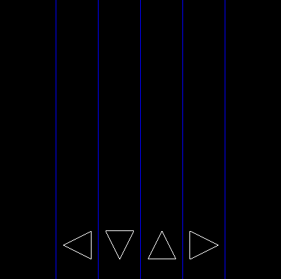
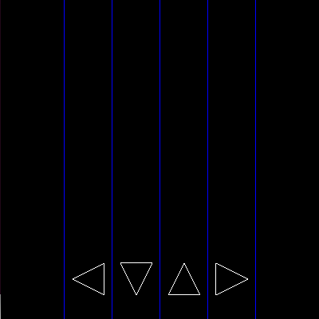

# fun-kortr-anim-dsl

Template code for Functional Kortrijk meetup "Animation DSL with Effect Handlers".

During the exercises we start from the files postfixed `_Exercise.hs`.


## Getting started using Stack

Install [stack](https://docs.haskellstack.org/en/stable/README/) if it is not installed.

Then, to test that everything compiles and runs:

```
stack setup
stack build
stack run
```

When everything builds succesfully, you should be greeted with a screen which looks like this:



Optionally, you can press X to play. Use the DFJK keys when the arrows move over the indicators at the bottom!



## Possible issues

If you encounter an issue, check whether your `stack` version is up to date usion `stack upgrade`.

On Ubuntu: you might need to install `freeglut3` and `freeglut3-dev` using `apt`.
